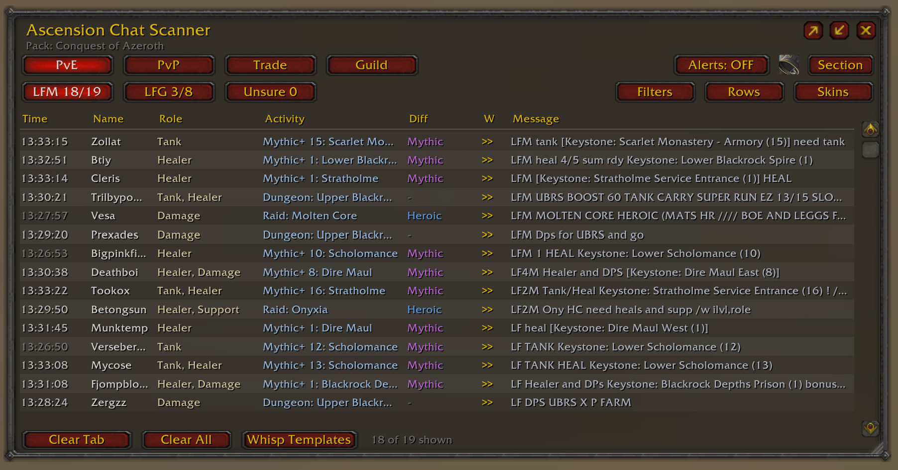
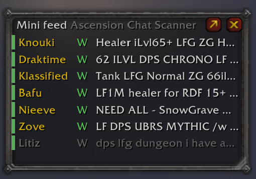
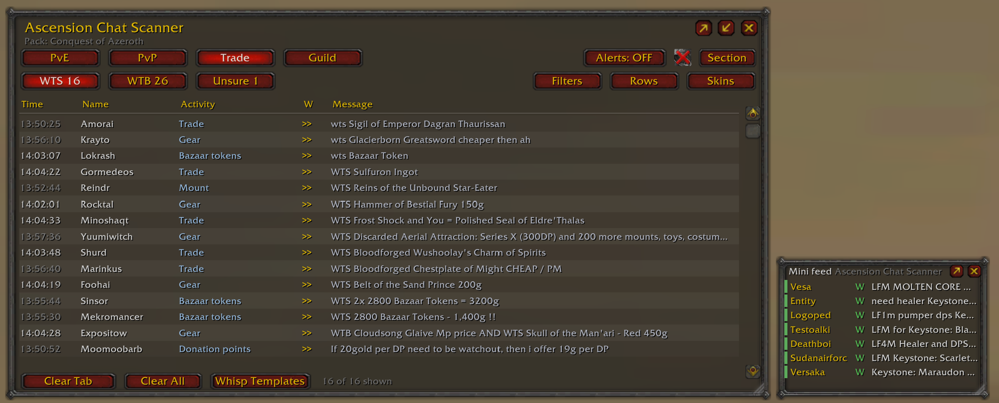
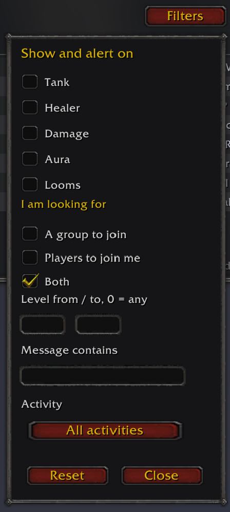
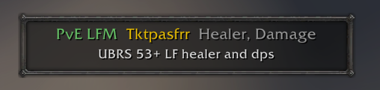
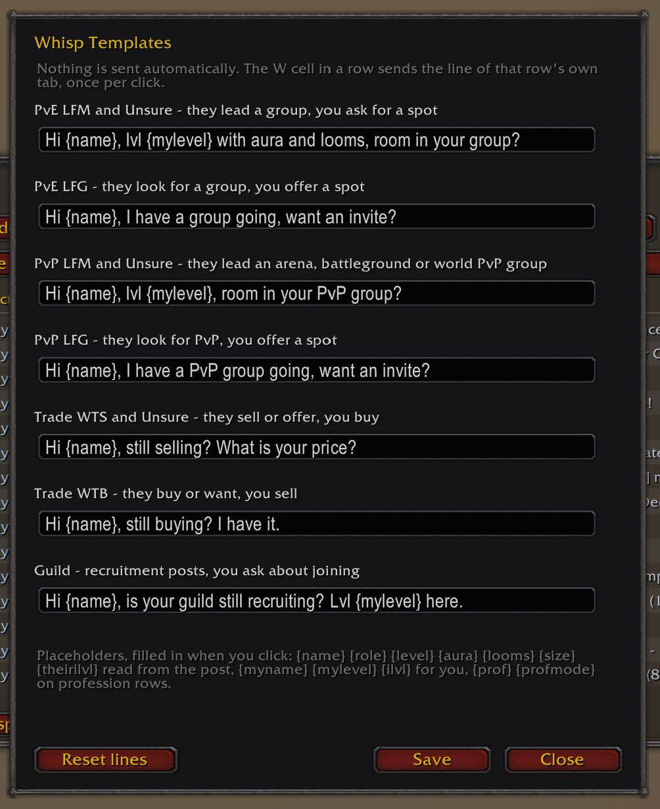

# Ascension Chat Scanner

A chat scanner for **World of Warcraft 3.3.5a**, built for **Project Ascension**. It watches every chat channel you have joined, recognises group, PvP and trade posts, and lists them in a sortable, filterable table with one-click whisper and invite from the row menu.



*The main window on the PvE LFM tab, twenty-seven posts held. Sections and tabs on the left, view controls on the right, raids and world bosses told apart from dungeons in the Activity column.*

---

## The folder must be named `AscensionChatScanner`

The client only loads an addon whose folder name matches its `.toc` file.

```
Interface\AddOns\AscensionChatScanner\AscensionChatScanner.toc       loads
Interface\AddOns\AscensionChatScanner-zip\AscensionChatScanner.toc  ignored
Interface\AddOns\AscensionChatScanner-main\AscensionChatScanner.toc  ignored
```

Download the release archive from the Releases page, the file listed under **Assets**, not "Source code (zip)". If you take the source zip, rename the extracted folder to `AscensionChatScanner` before you copy it in.

---

## Contents

- [Features](#features)
- [Installation](#installation)
- [Quick start](#quick-start)
- [Sections and tabs](#sections-and-tabs)
- [The table](#the-table)
- [Rows](#rows)
- [Mini mode](#mini-mode)
- [Filters](#filters)
- [Alerts](#alerts)
- [Whispers](#whispers)
- [Skins](#skins)
- [Content packs](#content-packs)
- [Commands](#commands)
- [Troubleshooting](#troubleshooting)
- [What the addon cannot know](#what-the-addon-cannot-know)
- [Licence](#licence)
- [Changelog](CHANGELOG.md)

---

## Features

- **Reads every channel you have joined** - numbered channels, guild, officer, party, raid, say, yell, whisper, emote, battleground. Two independent capture paths, so it sees what your chat frame sees.
- **Three sections, nine tabs** - PvE, PvP and Trade, each split by intent: LFM, LFG and Unsure for the group sections, WTS, WTB and Unsure for Trade.
- **Parses the post** - role, aura, heirlooms, level range, activity and traded goods, including compact forms such as `LF2M`, `3/3 aura`, `full looms`, `no aura`, `WTB 5x bazaar token`.
- **The parsed values are editable** - Role, Aura, Looms, iLvl, Filled and Level; click a cell to correct it, and your edit is locked so a later post never overwrites it.
- **Filters per section** - role, aura, looms, activity, level range and free text. Each section keeps its own filter set and only applies it in that section.
- **Rows** - pick which columns each section shows; the choice survives a logout.
- **Alerts** - sound, chat line or popup when a matching post appears, with a scope switch between the active section and everything.
- **One-click whisper** - six shared templates with ten placeholders: six read from the post, two more on profession rows and two describing your own character.
- **Mythic keystones** - the keystone level is read from the post and shown in place of the activity, so a row reads `Mythic+ 7: Uldaman`. Item links, `mythic+7`, `m+7` and `M0` are all understood.
- **Seven skins** and a resizable window that remembers its size and position.

---

## Installation

1. Close the game.
2. Copy the folder `AscensionChatScanner` into `Interface\AddOns`.
3. Start the game and make sure the addon is ticked in the character screen addon list.
4. Type `/acs`.

---

## Quick start

1. `/acs` opens the window.
2. Pick a section: **PvE**, **PvP** or **Trade**.
3. Pick a tab: **LFM**, **LFG** or **Unsure**, or **WTS**, **WTB** and **Unsure** in Trade.
4. Wait. Posts appear as they are written; nothing is read retroactively.
5. Right-click a row for whisper, invite, target, ignore and a manual move to another tab.

---

## Sections and tabs

The section row selects the topic, the tab row the intent.

| Section | Tabs | Meaning |
| --- | --- | --- |
| PvE | LFM, LFG, Unsure | Filling a group, looking for one, ambiguous |
| PvP | LFM, LFG, Unsure | Same, for arena and battlegrounds |
| Trade | WTS, WTB, Unsure | Selling, buying, ambiguous |

The number on a tab is how many rows it holds. With a filter on, it reads `4/29`: four rows shown out of twenty-nine.

---

## The table

| Column | Content |
| --- | --- |
| Time | When the post was seen |
| Name | The sender |
| Activity | What the post is about, from the content pack: raid, dungeon, random dungeon, world boss, with the named instance or boss where the post gives one. A mythic keystone shows its level instead: `Mythic+ 7: Uldaman` |
| Role | Tank, Healer, Damage, where the text says so |
| Aura | Yes or No from the post; set Maybe by hand when the post is unclear |
| Looms | Yes or No from the post; set Maybe by hand when the post is unclear |
| iLvl | The item level the post asks for, PvE and PvP. A bare number above 60 is read as an item level, because 60 is the level cap |
| Filled | Raid progress such as 15/25, PvE only |
| Level | The level or the level range in the text, up to the level cap of 60 |
| Message | The post itself |
| W | Sends the whisper line for this tab |

Click a header to sort, click again to reverse. Click a cell to correct it.

---

## Rows

The **Rows** button picks the columns. Each section stores its own set, the choice is saved per character, and **Clear All** empties every tab at once after a confirmation.

PvE starts with **Looms**, **iLvl** and **Filled** switched off, because few posts carry them and the space is better spent on the message. Switch any of them back on from the Rows button and the choice sticks.

---

## Mini mode

The **mini feed** is a small window with three columns, name, **W** and message, and nothing else. It lists every post that matched your alert rules, newest first, across all three sections when the alert scope is `All`. A thin coloured stripe on the left of a row says which section it came from: green PvE, red PvP, gold Trade.



*The mini feed. Name, **W** and message, with the section stripe on the left. The grey row has already been answered.*



*Both windows at once, here with Trade WTS in the main table and the feed carrying PvE alerts.*

It exists for the posts where seconds decide. The alert fires, the line is already in the feed, and one click on **W** sends your whisper.

- Two buttons sit in its top right corner. The close button closes the feed, the other one trades it for the full window.
- The feed collects even while alerts are muted and while the window is closed, because it follows the alert **rules**, not the alert **switch**.
- It holds the last 100 posts and drops anything older than `/acs expiry`.
- A line you already answered turns grey, as a reminder that you have written to that player.
- Left-click a name to open a whisper, right-click a row for the same menu as the full window.
- Drag the top strip to move the window, the bottom right corner to resize it. Position and size are remembered per character.
- Three buttons sit in the top right corner of the full window. Counting from the close button: close, trade the window for the feed, open the feed beside the window.

A word of warning: with wide alert rules the feed fills up in a minute and is useless. Mini mode pays off when your alert filters are narrow.

---

## Filters

The **Filters** button opens the filter panel for the active section. Role, aura, looms, what the sender is looking for, activity, level range and a free text field. A filter set belongs to its section: switch to another section and its own set applies, switch back and yours is still there.



*The PvE filter panel. Role, aura and looms at the top, then intent, level range, free text and activity.*

---

## Alerts

**Alerts** switches alerting on and off, the bell mutes the sound, and the scope button switches between **Section** and **All**.

- `/acs alert mode lfm | lfg | any` decides which intent alerts.
- `/acs alert move` unlocks the popup so you can drag it, `/acs alert reset` puts it back.
- The popup shows the sender, the tab and the text, and fades on its own.



*An alert popup. Section and intent on the left in the section colour, the sender, the roles wanted, and the post underneath.*

---

## Whispers

`/acs whisper` opens a panel with six lines: PvE LFM, PvE LFG, PvP LFM, PvP LFG, Trade WTS and Trade WTB. There are nine tabs and six lines, so the Unsure tabs share one: PvE and PvP Unsure use the LFM line of their section, Trade Unsure uses the WTS line.

Six placeholders are read from the post you are answering, two describe you, and two only appear on profession rows.

| Placeholder | Becomes |
| --- | --- |
| `{name}` | The sender's name |
| `{role}` | The role the post asks for or offers |
| `{level}` | The level stated in the post |
| `{aura}` | Whether the post mentions an aura |
| `{looms}` | Whether the post mentions heirlooms |
| `{size}` | The group size stated in the post |
| `{myname}` | Your name |
| `{mylevel}` | Your level |
| `{prof}` | The profession in the post |
| `{profmode}` | Whether that profession is wanted or offered |

The addon cannot read your own role, so no placeholder does that.

The **W** cell in a row sends the line for that row's tab. Set the six lines with the **Whisp Templates** button at the bottom of the window.



*The whisper panel with all six lines filled in. Nothing is sent until you click a **W** cell.*

---

## Skins

The **Skins** button switches between **Vanilla**, **Dark**, **Grid**, **Slate**, **Parchment**, **Glass** and **Felfire**. Vanilla is the stock dialog frame, Glass is a see-through window for a crowded screen, Felfire is loud green on near-black. Same thing from the command line with `/acs style dark`.

---

## Content packs

A pack decides which activities exist and how they are named. The pack follows your realm.

All three packs read the same content: the vanilla dungeons and raids, the world bosses, the random dungeon finder, mythic keystones, guild recruitment and High Risk. They differ only in what the realm adds.

A mythic post replaces the activity caption with its keystone level, so `LFM [Keystone: Uldaman (3)] need dps` reads `Mythic+ 3: Uldaman`. The level is taken from the bracketed number, from `mythic+7`, from `m+7` and from `LF +5 mythic key`. A number that counts players is left alone, and `Completed Mythic: 10` is ignored altogether, because it states the highest key the sender has ever finished rather than the level of the group. Mythic raids read `Mythic: Molten Core`, without a level, since no keystone applies to a raid. Everything mythic sits behind **Mythic+** in the Activity filter.

Guild recruitment sits in the group tabs but is not a group advert, so it stays hidden until **Guild** is picked in the Activity filter. A guild advert that talks about PvP lands in the PvP tab, everything else in PvE, and the Activity filter offers Guild in both.

High Risk is read as a PvP activity only where the line is about PvP. On their own the same two letters are the loot rule Hard Reserved, which raid and dungeon adverts use constantly, so `LF2M ZH HC HR MS/OS` stays a dungeon.

- **Conquest of Azeroth** is the base.
- **Ascension** adds Manastorm, both as an activity in the table and as an entry in the Activity filter.
- **Classic** adds a **Class** column and a class filter, because characters on that realm have one. The other realms are classless, so the column is not offered there at all.

| Realm | Pack |
| --- | --- |
| Vol'jin, Rexxar | Conquest of Azeroth |
| Area 52, Dawnrise, Darkmoon | Ascension |
| Bronzebeard | Classic |
| Any other realm | Ascension |

`/acs pack` shows the active pack, `/acs pack coa | ascension | classic | auto` switches it.

---

## Commands

| Command | Effect |
| --- | --- |
| `/acs` | Show or hide the window |
| `/acs pve \| pvp \| trade` | Pick a section |
| `/acs lfm \| lfg \| unsure \| wts \| wtb` | Pick a tab |
| `/acs style vanilla \| dark \| grid \| slate \| parchment \| glass \| felfire` | Same as the Skins button |
| `/acs clear` | Clear the current tab |
| `/acs clearall` | Clear everything |
| `/acs mini` | Open or close the mini feed |
| `/acs mini reset` | Put the mini feed back in the middle of the screen |
| `/acs minimap` | Show or hide the minimap button |
| `/acs alert on \| off \| sound \| chat \| popup` | Alert settings |
| `/acs alert mode lfm \| lfg \| any` | Which intent raises an alert |
| `/acs alert scope section \| all` | Same as the scope button |
| `/acs alert move` or `/acs alert unlock` | Unlock the popup so you can drag it |
| `/acs alert lock` | Fix the popup in place |
| `/acs alert reset` | Put the popup back in its default spot |
| `/acs expiry 900` | Seconds a row stays listed |
| `/acs own` | Include or exclude your own posts |
| `/acs pack` | Show the active content pack |
| `/acs pack coa \| ascension \| classic \| auto` | Switch the content pack |
| `/acs whisper` | Edit the whisper templates |
| `/acs whisper pvelfm \| pvelfg \| pvplfm \| pvplfg \| wts \| wtb <text>` | Set one whisper line |
| `/acs probe` | Print a diagnostic report, useful when reporting a bug |
| `/acs debug` | Print one line for every post the addon accepts |
| `/acs help` | The list above, in game |

---

## Troubleshooting

**The addon does not appear in the addon list.** The folder name does not match. It must be exactly `AscensionChatScanner`.

**The window is empty.** Nothing has been posted since you logged in. The addon cannot read chat that scrolled past before it loaded.

**A post landed in the wrong tab.** Right-click the row, choose Move to and pick the destination tab. If a whole class of posts lands wrong, it is a pack or parser matter.

**Settings were lost.** Saved variables are written on a clean logout or a `/reload`, never on a crash or an alt+f4.

---

## What the addon cannot know

It reads text, nothing else. It cannot see who is actually in a group, whether a spot is still open, whether the price is fair, or what someone meant by an ambiguous line. Anything the sender did not write is a guess, and guesses land in **Unsure**.

---

## Licence

Released under the MIT License. See the `LICENSE` file.
